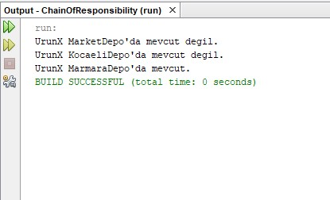

= Chain Of Responsibility

.Mert Hüseyin Uzan-160202009
Chain of Responsibility Tasarım Deseni *Davranışsal (Behavioral) Tasarım Desenleri* grubuna aittir. Birbirini takip eden iş dizisine ait işlemleri yönlendirme, cevaplama süreçleri için çözüm olarak ortaya çıkmıştır.Bu desende, istekle ilgili tüm nesneleri bir zincirin halkaları gibi dizilirler. Her nesne kendinden sonraki nesneyi bilir sadece ve kendine gelen isteği cevaplayamıyorsa isteği bir sonraki nesneye yönlendirir.

Bu projenin amacı stok kontrolü yapılması için gönderilen Ürün nesnesinin hangi Depoda olduğunu tespit etmektir. Chain Of Responsibility deseninin kullanılma amacı ise Depolar arasında bir zincir ilişkisi bulunup nesneyi birbirlerine yönlendiriyor olmalarıdır. Öncelikle MarketDepo'da kontrol edilen Ürün, stok olmaması durumunda bir üst zincirde olan KocaeliDepo'ya, orada da stok bulunmaması halinde bir üst zincirdeki MarmaraDepo'ya stok kontrolü için gönderilir.

.Chain Of Responsibility UML

[uml,file="chainOfResponsibility.png"]
--
left to right direction 
class ChainOfResponsibility{
+{static}void main()
}

class Urun{
+string urunAdi
+Urun()
}

abstract class DepoHandler{
#DepoHandler nextHandler
+void setNextHandler()
+abstract void check()
}

class MarketDepo{
+boolean stok
}

class KocaeliDepo{
+boolean stok
}

class MarmaraDepo{
+boolean stok
}

MarketDepo --|> DepoHandler
KocaeliDepo --|> DepoHandler
MarmaraDepo --|> DepoHandler
ChainOfResponsibility --> Urun
ChainOfResponsibility --> DepoHandler
--
DepoHandler -> Handler

MarketDepo -> ConcreteHandler1

KocaeliDepo -> ConcreteHandler2

MarmaraDepo -> ConcreteHandler3

.DepoHandler.java
[source,java]
----
public abstract class DepoHandler {
    ...
    public void setNextHandler(DepoHandler nextHandler){ //<1>
        this.nextHandler=nextHandler;
    }
    ...
}
----
.MarketDepo.java
[source,java]
----
class MarketDepo extends DepoHandler{
    ...
    public void check(Urun urun) {
        if(stok){
            ...
        }else if (nextHandler != null){ //<2>
            ...
            nextHandler.check(urun);
        }
    }
}
----
.ChainOfResponsibility.java
[source,java]
----
public static void main(String[] args) {
        ...
        marketHandler.setNextHandler(kocaeliHandler); //<1>
        kocaeliHandler.setNextHandler(marmaraHandler); //<1>
        
        Urun urun = new Urun("UrunX");
        marketHandler.check(urun);
    }
----
<1> Zincire bir sonraki sınıfın eklenmesi
<2> Zincirde bir sonraki sınıfın bulunup bulunmadığının kontrolü

Çalıştırma sonrası ekran görüntüsü:

*Main* fonksiyonunda belirtildiği üzere MarketDepo'dan sonra KocaeliDepo, ondan sonra da MarmaraDepo zincire eklenmiştir. Çalıştırma sonrasında Ürün nesnesi MarketDepo, KocaeliDepo ve MarmaraDepo'da sırasıyla gönderilerek stok kontrolü yapılmıştır. Stoğu bulunmayan ConcreteHandler, Urun nesnesini zincirde bir sonraki ConcreteHandler'a yönlendirmiştir.

    
    