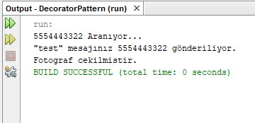

= Decorator

.Mert Hüseyin Uzan-160202009
Decorator tasarım deseni *Yapısal (Structural) Tasarım Desenleri* sınıfına aittir. Bu desen, nesnelere dinamik olarak yeni sorumluluklar atamamızı sağlar. Nesneyi kendisinden türeyen alt sınıflar ile genişletmek yerine kullanılabilen alternatif bir yaklaşım olarak düşünülebilir.

Bu projede amaç arama yapma ve mesaj gönderme metotlarına sahip olan Telefon sınıfının üzerinde değişiklik yapılmadan dinamik bir şekilde fotoğraf çekme metodunu kullanmasını sağlamaktır. Decorator deseni kullanılarak bu istek kolayca gerçekleştirilmiştir.

.Decorator Pattern UML

[uml,file="decorator.png"]
--
top to bottom direction 

class DecoratorPattern{
+{static}void main()
}

interface ITelefon{
+void aramaYap()
+void mesajGonder()
}

class Telefon{
}

abstract class TelefonDecorator{
+ITelefon telefon
+TelefonDecorator()
}

class TelefonFotograf{
+TelefonFotograf()
+void fotografCek()
}

DecoratorPattern ..> ITelefon : <<use>>

Telefon ..|> ITelefon
TelefonDecorator ..|> ITelefon
TelefonFotograf --|> TelefonDecorator
--

ITelefon -> Component

Telefon -> ConcreteComponent

TelefonDecorator -> Decorator

TelefonFotograf -> ConcreteDecorator

.ITelefon.java
[source,java]
----
public interface ITelefon {
    void aramaYap(String numara);
    void mesajGonder(String numara,String mesaj);
}
----

.Telefon.java
[source,java]
----
public class Telefon implements ITelefon {

    @Override
    public void aramaYap(String numara) {
        ...
    }

    @Override
    public void mesajGonder(String numara, String mesaj) {
        ...
    }  
}
----

.TelefonDecorator.java
[source,java]
----
abstract class TelefonDecorator implements ITelefon{
//Decorator
    ITelefon telefon;
    
    public TelefonDecorator(ITelefon telefon){
        this.telefon=telefon;
    }

    @Override
    public void aramaYap(String numara) {
        telefon.aramaYap(numara);
    }

    @Override
    public void mesajGonder(String numara, String mesaj) {
        telefon.mesajGonder(numara, mesaj);
    }
    
}
----

.TelefonFotograf.java
[source,java]
----
public class TelefonFotograf extends TelefonDecorator{
//ConcreteDecorator
    public TelefonFotograf(ITelefon telefon) {
        super(telefon);
    }
    
    public void fotografCek(){ // 
        ...
    }
    
}
----

.DecoratorPattern.java
[source,java]
----
...
public static void main(String[] args) {
        Telefon telefon = new Telefon();
        
        TelefonFotograf fTelefon = new TelefonFotograf(telefon);
        
        fTelefon.aramaYap(...);
        fTelefon.mesajGonder(...);
        fTelefon.fotografCek(...);
    }
...
----

Çalıştırma sonrası ekran görüntüsü:

Main içerisinde oluşturulan Telefon nesnesinde bulunan aramaYap() ve mesajGonder() metotlarına dinamik olarak fotografCek() metodu eklenmesi için telefon nesnesi, fTelefon adında TelefonFotograf isimli sınıfa ait nesneye atanmıştır. Oluşturulan fTelefon nesnesi sayesinde telefon nesnesi üzerinde değişiklik yapılmadan o telefon nesnesi için fotografCek() metodu kullanılabilir hale gelmiştir.

