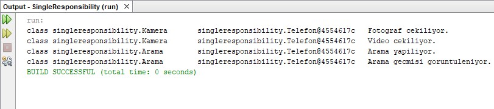

= Single Responsibility Principle

.Mert Hüseyin Uzan-160202009

Tek Sorumluluk Prensibi her class'ın tek bir sorumluluk üstlenmesi üzerine tasarlanmış bir prensiptir. Tek sorumlulukla anlatılmak istenen birbirileri ile mantıksal olarak ilişkili adımların bir arada olması gerektiğidir. Bu prensipte, yazılmış olan her bir classın kendi işinden sorumlu olup başka class'ların yapması gereken işleri yapmaması istenir. 

Bu projede amaç basit anlamda bir telefon simüle etmektir. Telefon arama yapabilir, arama geçmişi görüntüleyebilir, fotoğraf ve video çekebilir. SRP'nin buradaki kullanım amacı ise arama yapma ve arama geçmişi görüntüleme gibi çağrı işlemleri ile alakalı bir sınıfı fotoğraf ve video çekme gibi kamera işlemleriyle ayırmaktır. Çünkü bu iki metot farklı sorumluluk alanlarından oluşmaktadır.

.Single Responsibility Principle UML

[uml,file="singleResponsibility.png"]
--
left to right direction 

class SingleResponsibility{
+{static}void main()
}

class Kamera{
-Telefon telefon
+Kamera()
+void fotografCek()
+void videoCek()
}

class Arama{
-Telefon telefon
+Arama()
+void aramaYap()
+void aramaGecmisiGoruntule()
}

class Telefon{
-string marka
-int kamera
+string numara
+Telefon()
}

SingleResponsibility-->Telefon:<<use>>
Arama --* Telefon 
Kamera --* Telefon

--
.Kamera.java
[source,java]
----
public class Kamera {
    private Telefon telefon;
    
    Kamera(Telefon telefon){
        this.telefon=telefon;
    }
    void fotografCek(){
        ...
    }
    void videoCek(){
        ...
    }
}
----
.Arama.java
[source,java]
----
public class Arama {
    private Telefon telefon;
    
    Arama(Telefon telefon){
        this.telefon=telefon;
    }
    void aramaYap(String numara){
    ...
    }
    void aramaGecmisiGoruntule(){
    ...
    }
}
----
.SingleResponsibility.java
[source,java]
----
...
public static void main(String[] args) {
        Telefon telefon = new Telefon(...);
        Kamera kamera = new Kamera(telefon);
        Arama arama = new Arama(telefon);
        
        kamera.fotografCek();
        kamera.videoCek();
        arama.aramaYap(...);
        arama.aramaGecmisiGoruntule();

    }
...
----

Çalıştırma sonrası ekran görüntüsü:

Mainde Kamera ve Arama sınıflarının kullanılabilmesi için gerekli olan telefon nesnesi oluşturulmuştur. Ardından Kamera ve Arama sınıfları parametre olarak bu nesneyi almıştır. Bunun sonucunda Kamera sınıfından oluşturulan nesne ile çağrılan fotografCek videoCek fonksiyonları ve Arama sınıfından oluşturulan nesne ile çağrılan aramaYap ve aramaGecmisiGoruntule fonksiyonlari sadece parametre olarak verilen telefon için çalışmaktadır. Kamera ve Arama işlemleri farklı sorumluluklar olduğundan ayrı sınıflarda tanımlanmış ve bu sayede SRP'ye uygun olarak tasarlanmıştır.
    